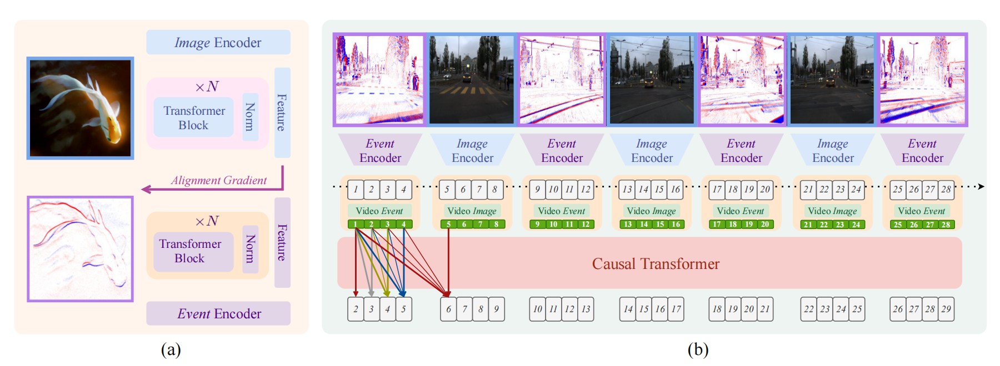
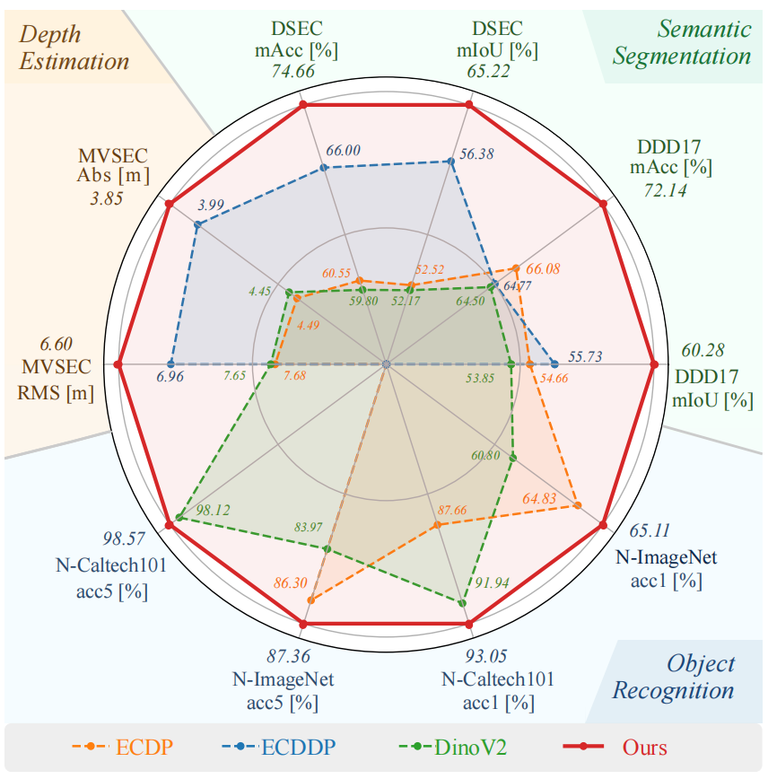

<p align="center">
  <h1 align="center"> Generative Event Pretraining with Foundation Model Alignment </h1>
  <p align="center">
    <a href="https://www.linkedin.com/in/jianwen-cao-042730351/">Jianwen Cao</a>
    ,
    <a href="https://jiaxux.ing/">Jiaxu Xing</a>
    ,
    <a href="https://messikommernico.github.io/">Nico Messikommer</a>
    ,
    <a href="https://rpg.ifi.uzh.ch/people_scaramuzza.html">Davide Scaramuzza</a>
  </p>
  <p align="center">
    <i>Robotics and Perception Group, University of Zürich</i>
  </p>
  <p align="center"> <strong> CVPR 2026 Findings </strong></p>
  <h3 align="center">

## 📖 Description   

This repository provides the official implementation for the paper "Generative Event Pretraining with Foundation Model Alignment". It features a two-stage pre-training framework that aligns event data with visual representations and further trains generative models for downstream applications.

<!-- TODO: Insert your framework overview image here -->


---

## 🛠️ Setup

**1. Create a Conda Environment**
We recommend using Conda to isolate your dependencies. Create a new environment named `gep` with Python 3.12:
```bash
conda create -n gep python=3.12 -y
conda activate gep
```

**2. Install PyTorch and CUDA Dependencies**
Install PyTorch 2.6.0 with CUDA 11.8 support:
```bash
pip install torch==2.6.0+cu118 torchvision==0.21.0+cu118 torchaudio==2.6.0+cu118 --extra-index-url https://download.pytorch.org/whl/cu118
```

**3. Install Remaining Requirements**
You can install the rest of the required packages using the provided `environment.yml` file via `conda env update`, or simply install them via `pip`:
```bash
conda env update -n gep -f environment.yml
```

---

## 🗂️ 1. Dataset Preparation & Preprocessing

The pipeline supports multiple datasets. Before running the preprocessing scripts, ensure your raw data is organized according to the expected structures below. You will likely need to adjust the hardcoded paths inside the corresponding `src/pre_*.py` files to match your local setup.

**[N-ImageNet](https://github.com/82magnolia/n_imagenet) (`src/pre_nim.py`)**
*   **Expected Structure:** The script expects standard N-ImageNet structure organized by WordNet ID folders containing `.bin` event files.

**[N-Caltech101](https://www.garrickorchard.com/datasets/n-caltech101) (`src/pre_nca.py`)**
*   **Expected Structure:** Ensure you have the original `caltech-101/101_ObjectCategories` data and the N-Caltech101 event data. The script uses these to pair and convert event streams. Set the `PRE_NCA_DATASET_ROOT` and `PRE_NCA_ORIGINAL_ROOT` environment variables or edit the script directly.

**[DSEC](https://dsec.ifi.uzh.ch/) (`src/pre_dse.py`)**
*   **Expected Structure:** Typical DSEC structure with split folders (e.g., `train`, `test`) containing sequence directories (like `interlaken_00_c/`).

**[MVSEC](https://daniilidis-group.github.io/mvsec/) (`src/pre_mvs.py`)**
*   **Expected Structure:** Download the standard sequences (`outdoor_day1`, `outdoor_day2`, `outdoor_night1`, `outdoor_night2`, `outdoor_night3`). The script expects HDF5 format data (`*_data.hdf5` and `*_gt.hdf5`). Edit the `DATASETS` dictionary inside `src/pre_mvs.py` to point to your HDF5 files.

**[EventScape](https://rpg.ifi.uzh.ch/RAMNet.html) (`src/pre_sca.py`)**
*   **Expected Structure:** The dataset should be structured as `<dataset_root>/<split>/<cluster_name>/<sequence_name>/`. Inside each sequence folder, the script expects:
    *   `events/data/*.npz`
    *   `rgb/data/*.png`
*   **Output:** The script will create an `event_images` folder alongside them.

**[DDD17](https://unizares-my.sharepoint.com/:f:/g/personal/acm_unizar_es/Eiz_9LWWOEJAmmtfiAXWS0QB5pzfHHaA5K-41HrMo2sVdQ?e=f3fhxM) (`src/pre_ddd.py`)**
*   **Expected Structure:** Change `TOP_LEVEL_DATA_DIR` in the script to your root data directory. Inside, it expects subdirectories (e.g., `dir1`, `dir2`). Each must contain:
    *   `events.dat.xyp`
    *   `events.dat.t`
    *   `index/index_250ms.npy`

To aggregate raw events into event images, run the corresponding script. For example:
```bash
# Modify hardcoded paths inside src/pre_sca.py first, then run:
python src/pre_dse.py
```

---

## ⚙️ 2. Two-Stage Pre-training Pipeline

> **Configuration Note:**
> All configurations (dataset paths, hyperparameters, model choices) must be explicitly modified inside **`src/config.py`** before running the scripts.

### Stage 1: Cross-Modal Alignment
In this stage, the event encoder is aligned with a pre-trained image encoder via grafting/alignment. Modify the `GraConfig` class inside `src/config.py` to set your data paths, batch size, and learning rate.

```bash
# Run Stage 1 alignment (after updating GraConfig in src/config.py)
python src/gra.py
```
*(Optional)* You can override loss types directly via CLI: `python src/gra.py --losses_type mse:1.0,cos:0.5`

### Saving Tokens for Stage 2
Once you have an aligned event encoder from Stage 1, you need to extract and save the patch tokens to disk. This heavily accelerates Stage 2 training.

Some scripts support a `--process-tokens` flag or have a dedicated tokenization function uncommented inside the script. You will need to load your Stage 1 checkpoint inside the preprocessing script to extract the features:
```bash
# Example for DSEC: Modify src/pre_dse.py to load your stage 1 checkpoint, then run:
python src/pre_dse.py --process-tokens --token-workers 8
```
*This will create `eventToken` and `imageToken` directories containing `.pt` files.*

### Stage 2: Generative Pre-training
With the tokens saved to disk, you can run the generative pre-training (e.g., GPT-style masked modeling/next token prediction). Modify the `GPTConfig` class inside `src/config.py` to point to the saved tokens.

```bash
# Run Stage 2 training (after updating GPTConfig in src/config.py)
python src/gpt.py
```

---

## 🚀 3. Downstream Tasks: Training & Inference

You can train and evaluate the representations using the provided downstream task scripts: Classification (`cls`), Semantic Segmentation (`seg`), and Depth Estimation (`dep`).

Like the pre-training stages, you **must modify the corresponding configuration class** in `src/config.py` (`CLSConfig`, `SegConfig`, `DepConfig`) to specify:
1.  The path to your pre-trained backbone checkpoint.
2.  The dataset root directories.
3.  Training hyperparameters.
4.  Whether you are running training or just loading a checkpoint for evaluation (by setting `eval_only = True` inside the config if implemented, or modifying the execution loop in the main script).

**To Train or Infer:**

**1. Classification**
```bash
# Modify CLSConfig in src/config.py, then run:
python src/cls.py
```

**2. Semantic Segmentation**
```bash
# Modify SegConfig in src/config.py, then run:
python src/seg.py
```

**3. Depth Estimation**
```bash
# Modify DepConfig (or arguments if using dep.py directly), then run:
python src/dep.py
```

<!-- TODO: Insert downstream task results/visualizations here -->


---

## 📦 Pre-trained Models

We provide the pre-trained checkpoints for our event encoder aligned with foundation models:
*   **Event Encoder:** [Download from Google Drive](https://drive.google.com/file/d/1AlLCLql-zm_kPfq8zIxs6rGOpNsDHoSG/view?usp=sharing)

---

## 🙏 Acknowledgements

We would like to thank the authors of the following repositories for their excellent work and for making their code publicly available:
*   [MEM](https://github.com/tum-vision/mem)
*   [Event-Camera-Data-Pre-training](https://github.com/Yan98/Event-Camera-Data-Pre-training)
*   [Event-Camera-Data-Dense-Pre-training](https://github.com/Yan98/Event-Camera-Data-Dense-Pre-training/)
*   [TESPEC](https://github.com/MhdMohammadi/TESPEC)
*   [STP](https://github.com/Lqm26/STP)
